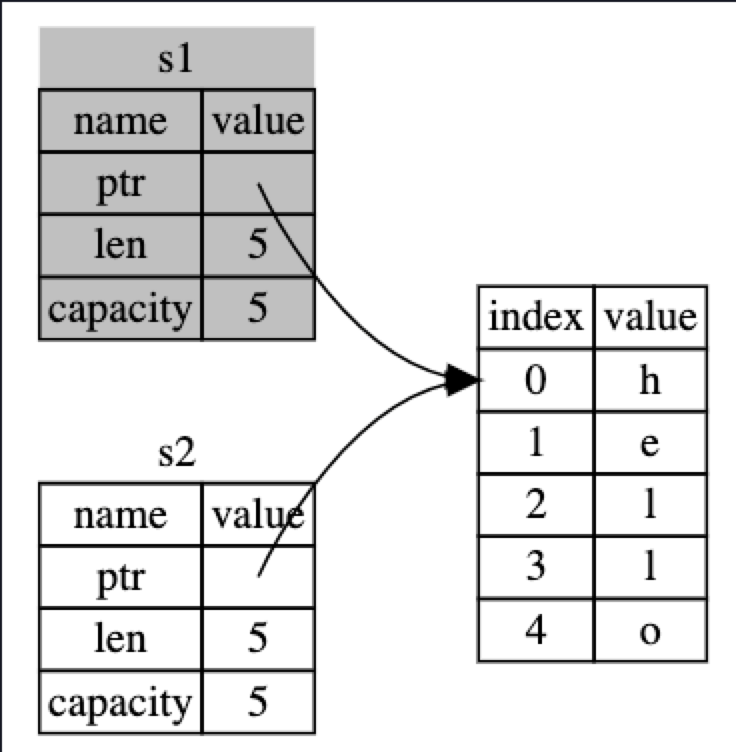
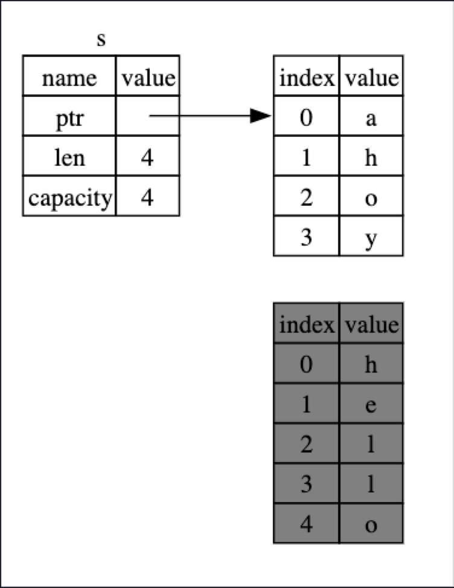
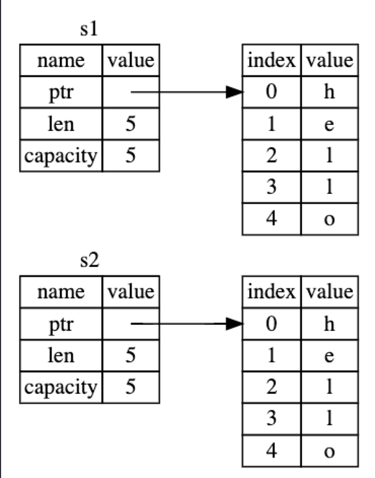
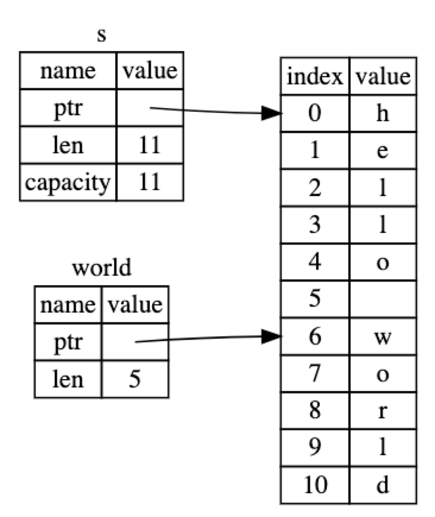

= 所有权
:scripts: cjk
:toc: left
:toclevels: 3
:toc-title: 目录
:numbered:
:sectnums:
:sectnum-depth: 3
:source-highlighter: coderay

== 所有权(ownership)

Rust 用于如何管理内存的一组规则

== 栈与堆

=== 栈(Stack)

* 后进先出(LIFO, last in, first out)
* 栈中的所有数据都必须占用已知且固定的大小
* 增加数据叫做入栈(pushing onto the stack)，而移出数据叫做出栈(popping off the stack)
* 当调用函数时，传递的值(包括可能指向堆上数据的指针)和函数的局部变量被压入栈中；当函数结束时，这些值被移出栈

=== 堆(Heap)

* 当向堆放入数据时，你要请求一定大小的空间
* 内存分配器(`memory allocator`)在堆的某处找到一块足够大的空位，把它标记为已使用，并返回一个表示该位置地址的指针 `pointer`。这个过程称作在堆上分配内存(allocating on the heap)，简称为 “分配”(allocating)
* 将数据推入栈中并不被认为是分配
* 因为指向放入堆中数据的指针是已知的并且大小是固定的，你可以将该指针存储在栈上，不过当需要实际数据时，必须访问指针

=== 对比

* 入栈比在堆上分配内存快，因为不用去搜索内存空间，其位置总是在栈顶；而在堆上分配内存则必须首先找到一块足够存放数据的内存空间，并接着做一些记录为下一次分配做准备
* 访问堆上的数据比访问栈上的数据慢，因为必须通过指针来访问，这样会有跳转；而且在多次访问不同的数据时，在栈上相对较近的跳转访问比在堆中相对较远的跳转访问效率要高

== 所有权规则

* Rust 中的每一个值都有一个所有者(`owner`)
* 值在任一时刻有且只有一个所有者
* 当所有者离开作用域，这个值将被丢弃

== 内存与分配

=== Rust内存管理规则

内存在拥有它的变量离开作用域后就被自动释放

=== String的内存管理

==== 变量给变量赋值

[source,rust]
----
fn main() {
    let s1 = String::from("hello");
}
----

[plantuml,,svg]
----
@startyaml
name: value
ptr:
    index: value
    0: h
    1: e
    2: l
    3: l
    4: o
len: 5
capacity: 5
@endyaml
----

[source,rust]
----
fn main() {
    let s1 = String::from("hello");
    let s2 = s1;
}
----

==== 重新赋值(`mut`)

[source,rust]
----
fn main() {
    let mut s = String::from("hello");
    s = String::from("ahoy");
}
----

==== 克隆

[source,rust]
----
fn main() {
    let s1 = String::from("hello");
    let s2 = s1.clone();
}
----

=== Copy Trait的内存管理

[source,rust]
----
fn main() {
    let x = 5;
    let y = x;
}
----

* 在创建变量 `y` 后 `x` 仍然有效
* 基础类型内容直接存储在栈上，所以直接在栈上拷贝数据
* 常见实现了 `Copy trait` 的类型:
** 所有整数类型，比如 u32
** 布尔类型，bool，它的值是 true 和 false
** 所有浮点数类型，比如 f64
** 字符类型，char
** 元组，当且仅当其包含的类型也都实现 Copy 的时候。比如，(i32, i32) 实现了 Copy，但 (i32, String) 就没有

== 所有权与函数

[source,rust]
----
fn main() {
    let s = String::from("hello");  // s 进入作用域

    takes_ownership(s);             // s 的值移动到函数里 ...
                                    // ... 所以到这里不再有效

    let x = 5;                      // x 进入作用域

    makes_copy(x);                  // x 应该移动函数里，
                                    // 但 i32 是 Copy 的，
    println!("{}", x);              // 所以在后面可继续使用 x

} // 这里，x 先移出了作用域，然后是 s。但因为 s 的值已被移走，
  // 没有特殊之处

fn takes_ownership(some_string: String) { // some_string 进入作用域
    println!("{some_string}");
} // 这里，some_string 移出作用域并调用 `drop` 方法。
  // 占用的内存被释放

fn makes_copy(some_integer: i32) { // some_integer 进入作用域
    println!("{some_integer}");
} // 这里，some_integer 移出作用域。没有特殊之处
----

== 返回值与作用域

[source,rust]
----
fn main() {
    let s1 = gives_ownership();        // gives_ownership 将它的返回值传递给 s1

    let s2 = String::from("hello");    // s2 进入作用域

    let s3 = takes_and_gives_back(s2); // s2 被传入 takes_and_gives_back,
                                       // 它的返回值又传递给 s3
} // 此处，s3 移出作用域并被丢弃。s2 被 move，所以无事发生
  // s1 移出作用域并被丢弃

fn gives_ownership() -> String {       // gives_ownership 将会把返回值传入
                                       // 调用它的函数

    let some_string = String::from("yours"); // some_string 进入作用域

    some_string                        // 返回 some_string 并将其移至调用函数
}

// 该函数将传入字符串并返回该值
fn takes_and_gives_back(a_string: String) -> String {
    // a_string 进入作用域

    a_string  // 返回 a_string 并移出给调用的函数
}
----

== 引用(reference)

=== 简单使用

* 引用是一个地址，像指针一样，可以由此访问储存于该地址的数据，这个数据由其它变量所拥有
* 与指针不同，引用保证在其生命周期内指向一个有效的值
* 下面定义和使用一个函数，该函数将对象的引用作为参数，而不是获取值的所有权
+
[source,rust]
----
fn main() {
    let s1 = String::from("hello");

    let len = calculate_length(&s1);

    println!("The length of '{s1}' is {len}.");
}

fn calculate_length(s: &String) -> usize {
    s.len()
}
----

`&s1` 创建一个引用 `s` 指向 `s1` 的值，但并不拥有该值(所以当 `s` 被释放时，它所指向的值并不会被释放)
+
[plantuml,,svg]
----
@startyaml
s:
    name: value
    ptr:
        s1:
            name: value
            ptr:
                index: value
                0: h
                1: e
                2: l
                3: l
                4: o
            len: 5
            capacity: 5
@endyaml
----

* `&` 是引用，其相反操作是解引用，运算符是 `*`

=== 借用(Borrowing)

* 创建引用的操作
* 不能修改借用的值

=== 可变引用(Mutable References)

* 声明变量用 `mut` 修饰，传递时用 `&mut`(如果只用 `&`，说明只是不可变引用)
+
[source,rust]
----
fn main() {
    let mut s = String::from("hello");

    change(&mut s);
}

fn change(some_string: &mut String) {
    some_string.push_str(", world");
}
----

* Rust 在编译时预防数据竞争(数据竞争类似于竞态条件，会导致未定义行为，并且在运行时试图追踪它们时，可能难以诊断和修复)
* 限制: 不能一次创建两个及以上的可变引用，错误示例如下:
+
[source,rust]
----
fn main() {
    let mut s = String::from("hello");

    let r1 = &mut s;
    let r2 = &mut s;

    println!("{}, {}", r1, r2);
}
----
* 可以通过花括号创建一个新的作用域来绕开这个限制
+
[source,rust]
----
fn main() {
    let mut s = String::from("hello");

    {
        let r1 = &mut s;
    } // 在这里 r1 被释放, 所以后面可以创建新的可变引用.

    let r2 = &mut s;
}
----
* 在任何时候，要么有一个可变引用，要么有任意个不可变引用(可变与不可变引用不能共存)
* 注意: 引用的作用域从其声明处开始，一直持续到该引用最后一次被使用的地方，所以下面的代码是没问题的
+
[source,rust]
----
fn main() {
    let mut s = String::from("hello");

    let r1 = &s; // 没问题
    let r2 = &s; // 没问题
    println!("{r1} and {r2}");
    // 后面的代码没有使用 r1 和 r2

    let r3 = &mut s; // 没问题
    println!("{r3}");
}
----

=== 悬垂引用(Dangling References)

* 在有指针的语言中，很容易错误地创建一个悬空指针（dangling pointer），这是因为在释放某些变量时，仍然保留了指向该变量内存的指针
* Rust 避免了这种情况，因为编译器会检查指针的引用是否仍然有效，下面的代码编译时会报错
+
[source,rust]
----
fn main() {
    let reference_to_nothing = dangle();
}

fn dangle() -> &String {
    let s = String::from("hello");
    &s
}
----

** 因为 `s` 是在 `dangle` 函数内部创建的，当 `dangle` 函数的代码执行完毕时，`s` 将被释放。当返回对它的引用，就会将指向一个无效的 `String`，这是不被允许的
** 解决办法是直接返回 String
+
[source,rust]
----
fn no_dangle() -> String {
    let s = String::from("hello");
    s                               // 返回 s，所有权被转移出去，并且没有任何东西被释放
}
----

== 切片(slice)

* 切片允许你引用集合中一段连续的元素序列，而非整个集合
* 切片是一种引用，所以它没有所有权

=== 字符串切片(String Slices)

* 字符串切片是对 `String` 一部分的引用，代码如下:
+
[source,rust]
----
fn main() {
    let s = String::from("hello world");

    let hello = &s[0..5];
    let world = &s[6..11];
}
----

* 字符串字面量就是一个字符串切片(`&str`)，所以是不可变引用
* 有经验的开发者会将参数声明为 `&str`，这样 `&String` 和 `&str` 都可以使用此函数
+
[source,rust]
----
// fn first_word(s: &String) -> &str {
fn first_word(s: &str) -> &str {
    // --snip--
}
----